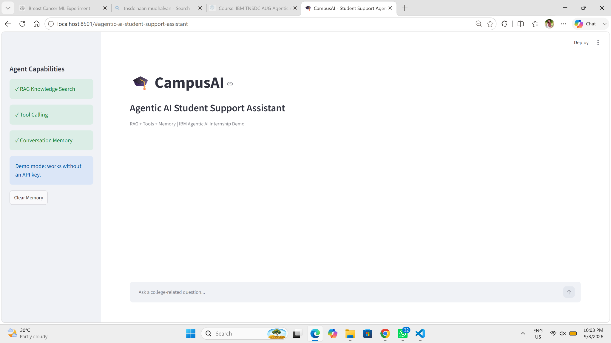
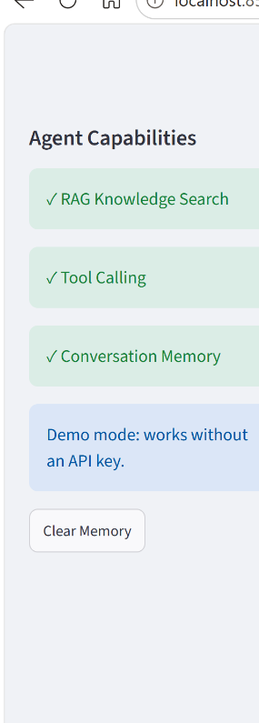
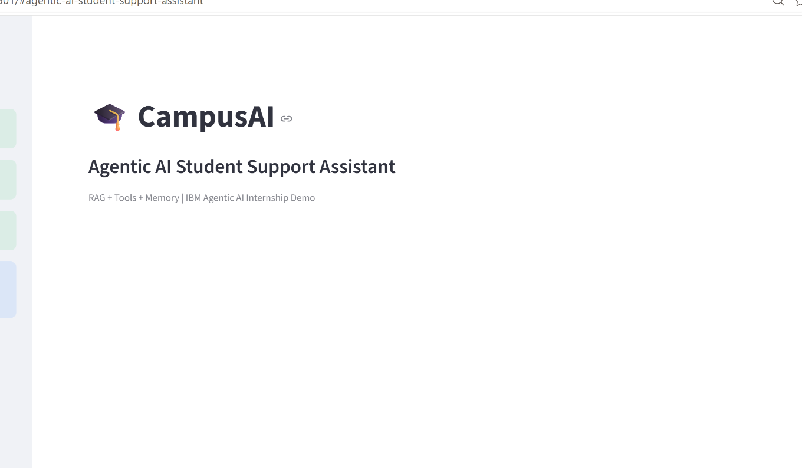

# CampusAI — Agentic AI Student Support Assistant

> TNSDC – IBM Agentic AI Internship project demonstrating **RAG-style retrieval, tool calling, and session-based memory** in a Streamlit application.

## Overview

CampusAI is a lightweight student-support assistant that accepts natural-language college queries and routes them to an appropriate capability:

- **RAG-style Knowledge Search** — retrieves relevant content from a local college knowledge base using TF-IDF and cosine similarity.
- **Attendance Tool** — returns attendance information through a dedicated function.
- **Timetable Tool** — returns a day-wise timetable through a dedicated function.
- **Conversation Memory** — stores the current chat history using Streamlit session state.
- **Execution Trace** — exposes the selected capability for demonstration and viva purposes.

> **Scope note:** The current implementation is a local demonstration prototype. Its “agent” is a lightweight rule-based intent router, and its RAG path retrieves grounded text rather than calling an external generative model. Future versions can integrate IBM watsonx.ai/Granite or another LLM.

## Features

| Capability | Implementation |
|---|---|
| Conversational UI | Streamlit chat interface |
| Knowledge retrieval | TF-IDF + cosine similarity |
| Knowledge source | `data/college_knowledge.txt` |
| Tool calling | Attendance + Timetable functions |
| Memory | `st.session_state.messages` |
| External API dependency | None in demo mode |
| Explainability | Agent execution trace |

## Architecture

```text
Student
   ↓
Streamlit Chat Interface
   ↓
Agent / Intent Router
   ├── RAG Knowledge Search → Local Knowledge Base
   ├── Attendance Tool
   └── Timetable Tool
   ↓
Grounded Response
   ↓
Conversation Memory
```

See the visual architecture in [`docs/diagrams/system-architecture.png`](docs/diagrams/system-architecture.png).

## Project Structure

```text
CampusAI/
├── app.py
├── requirements.txt
├── data/
│   └── college_knowledge.txt
├── docs/
│   ├── diagrams/
│   │   ├── agent-workflow.png
│   │   ├── rag-pipeline.png
│   │   └── system-architecture.png
│   └── screenshots/
│       ├── campusai-full-interface.png
│       ├── campusai-sidebar-capabilities.png
│       ├── campusai-chat-interface.png
│       └── campusai-header.png
├── README.md
├── LICENSE
├── .gitignore
└── CONTRIBUTING.md
```

## Installation

### 1. Clone the repository

```bash
git clone <YOUR_GITHUB_REPOSITORY_URL>
cd CampusAI
```

### 2. Create a virtual environment (recommended)

**Windows PowerShell**
```powershell
python -m venv .venv
.\.venv\Scripts\Activate.ps1
```

**Windows Command Prompt**
```cmd
python -m venv .venv
.venv\Scripts\activate
```

### 3. Install dependencies

```bash
python -m pip install -r requirements.txt
```

### 4. Run the application

```bash
python -m streamlit run app.py
```

Open the local URL displayed by Streamlit, usually `http://localhost:8501`.

## Demo Questions

Try these in order:

1. `What is the minimum attendance requirement?`
2. `What is my attendance percentage?`
3. `Give me Monday timetable.`
4. `How do I apply for a bonafide certificate?`
5. `What does the syllabus include?`
6. `What should I prepare for placements?`

The first, fourth, fifth and sixth questions exercise knowledge retrieval. Attendance and timetable questions exercise tool calling. The visible conversation demonstrates session memory.

## Knowledge Base

The supplied `data/college_knowledge.txt` is **demonstration data**. Before real-world use, replace it with approved institutional material such as:

- Regulations
- Syllabus
- Examination circulars
- Certificate procedures
- Fee notices
- Leave rules
- Placement notices
- Project guidelines

Do not use chatbot output as the final authority for official academic decisions.

## Screenshots

### Working interface


### Agent capabilities sidebar


### Chat interface


## Technology Stack

- Python
- Streamlit
- Scikit-learn
- TF-IDF vectorization
- Cosine similarity
- Streamlit Session State

## Limitations

1. Attendance and timetable data are static demonstration values.
2. The knowledge base is local and manually maintained.
3. Intent detection is rule-based.
4. The current prototype does not use an external LLM.
5. Session memory is not persistent after the Streamlit session ends.
6. No authentication or role-based access is implemented.

## Future Enhancements

- Integrate IBM watsonx.ai / Granite
- Replace TF-IDF with a production vector database and embeddings
- Connect real college APIs
- Add authentication and role-based access
- Add Tamil-English multilingual support
- Add document upload and automated knowledge-base indexing
- Add persistent conversation storage
- Deploy through a cloud platform
- Add automated testing and CI/CD

## Academic / Internship Value

This project demonstrates the core ideas expected from an introductory Agentic AI prototype: **intent-driven capability selection, retrieval grounding, tool execution, and conversational state**.

## License

This project is provided for academic and internship demonstration purposes. See [`LICENSE`](LICENSE).

## Author

**Student Name:** ______________________________  
**Register Number:** ____________________________  
**Institution:** University College of Engineering, Villupuram  
**Program:** B.Tech Information Technology  
**Internship:** TNSDC – IBM Agentic AI Internship
